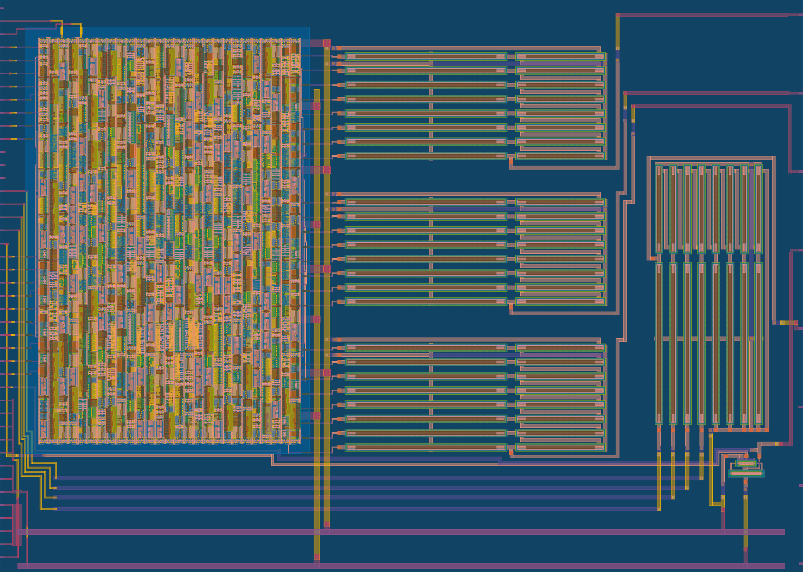

 

> [!NOTE]
> If I submit this repo to more than one Tiny Tapeout shuttle, the `main` branch will typically be the latest production code, and each final accepted TT submission will have its own tag.


# TT07 VGA FUN!

## General project info

> [!TIP]
> **For much more information, [read the full documentation for the Tiny Tapeout datasheet](docs/info.md)**

This is a simple analog/mixed-signal project. It was created out of my earlier [tt06-grab-bag](https://github.com/algofoogle/tt06-grab-bag) project ([submitted to TT06](https://tinytapeout.com/runs/tt06/492/), per [tag `tt06`](https://github.com/algofoogle/tt06-grab-bag/releases/tag/tt06)). It has been updated per the [TT07 analog template repo](https://github.com/TinyTapeout/tt07-analog-template).

The main purpose of this project is to produce a VGA display using analog RGB outputs derived from digital 24-bit (RGB888) colour signals internally.



BACKGROUND: I was invited to participate in the first round of Matt Venn's Zero to ASIC **Analog Course** beta, and this was the design I ultimately submitted to TT06.

It implements:
*   A bog-standard CMOS inverter. That was my very first custom layout attempt.
*   A digital block that generates a few basic 24b-colour (RGB888) VGA test patterns.
*   Analog RGB outputs (running digital block VGA outputs through 3x 8-bit R2R DACs).
*   An extra 4-bit R2R DAC.

## Simulation

This project can be simulated in the following ways:
1.  Verilator:
    ```bash
    cd sim/verilator
    make csr # clean, sim_random
    ```
    Very fast (close to realtime) but just simulates the digital part. *Digital* RGB888 outputs are converted directly to perfect colours.
2.  Mixed-signal cosimulation:
    ```bash
    cd sim/spice
    make cleanmixed
    ```
    Slow (about 2min/line). ngspice uses Verilator to simulate the digital part, then it simulates the basic analog parts using SPICE.
3.  Full SPICE simulation:
    ```bash
    cd sim/spice
    make cleanfull
    ```
    Very slow (about 8hrs/line). ngspice runs a full analog simulation of the entire extracted layout (including the digital block).

Note that there are differences in how the simulations represent the circuit, so some have worse characterization than others. For example, option 1 is (impossibly) perfect, option 2 renders the DAC both with and without output buffering (and also zero impedance output from the digital circuit), and option 3 is the most realistic by far.


# What is Tiny Tapeout?

Tiny Tapeout is an educational project that aims to make it easier and cheaper than ever to get your digital designs manufactured on a real chip.

To learn more and get started, visit https://tinytapeout.com.

# Analog projects

For specifications and instructions, see the [analog specs page](https://tinytapeout.com/specs/analog/).


# Resources

- [FAQ](https://tinytapeout.com/faq/)
- [Digital design lessons](https://tinytapeout.com/digital_design/)
- [Learn how semiconductors work](https://tinytapeout.com/siliwiz/)
- [Join the community](https://tinytapeout.com/discord)
- [Build your design locally](https://docs.google.com/document/d/1aUUZ1jthRpg4QURIIyzlOaPWlmQzr-jBn3wZipVUPt4)

